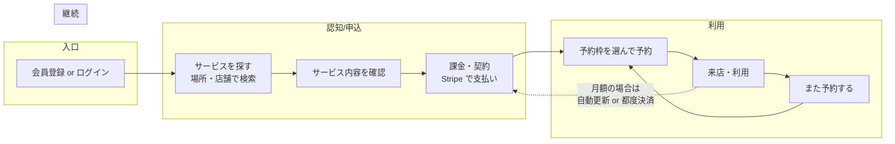
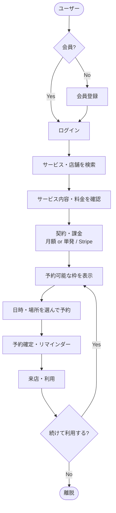

# サービスの仕様について

> 決まっていない仕様

## 1. サービス構成・決済・契約

### サービス構成
- 現状はテナントごとにサービスを作成し、それに予約枠を生やしている。この形でよいか?
- **案A**: 会社単位で統一サービスにする → ただし機材が場所ごとに用意できていない可能性がある
- **案B**: 会社統一サービス + テナント独自サービス（ハイブリッド）

※どの構成にしても、以下は別途決める必要がある。

### 決済
- お客さんの決済方法は? Stripe でクレジットのみにするか?
- 現金対応ありだと実装・運用がさらに面倒になる

### 契約形態
- 月額サービスだけを想定しているか? 単発利用はあるか?
- **月額の場合の課金周期**
  - 1日始まりで、月の途中加入時は翌月1日まで日割り?
  - シンプルなのは「その日から1ヶ月」だが、2月28日や31日ある月の月末加入時の扱いが曖昧になる
- Stripe がここまでをよい感じに処理してくれるか? → **早く調べる必要あり**

---

## 2. 出店形態（移動テナント・固定テナント）

- 両方を持つ会社のため、出店場所を複数登録できるようにしている
- **検討事項**: 移動テナントの場合、屋台（物理的な出店単位）は1つだけか?
- 予約枠を「同時に別の場所」に持てる設計でよいか?（1台しかないのに複数場所で枠を張れる状態にしてよいか）

---

## 3. ユーザーストーリー：課金〜通い続けるまで

上記を縦にした詳細フロー:

---

## 4. 他に考えないといけないこと

### 予約フロー・ポリシー
- **確定方式**: 即時確定（immediate）か、スタッフ承認制（approval）か。承認制なら誰が承認するか・通知はどうするか
- **単発利用の支払いタイミング**: 予約時に事前決済か、利用後請求か
- **No-show**: 来店しなかった場合の扱い（ペナルティ・返金なし・繰り返し時の制限など）
- **キャンセル・変更時の返金**: Stripe と連携して自動返金するか、運用で対応するか

### 課金とサービスの紐付け
- **1契約の範囲**: 1契約＝1サービスか、複数サービスを束ねたプラン（バンドル）もあり得るか
- **解約・退会**: 解約後いつまで予約可能か、クーリングオフや返金ポリシー
- **無料トライアル**: あるか、ある場合の期間と条件

### 顧客・アカウント
- **1ユーザーと複数テナント**: 同じ会員が別テナント（別店舗）のサービスも利用する想定か。する場合、契約・課金はテナントごとか会社まとめか
- **会員情報**: 登録時に必須にする項目（名前・電話・メールなど）。スタッフが顧客メモを編集できるか（UserProfiles の運用）

### 会社・テナントの運用
- **会社単位の集計**: 複数テナントを持つ会社向けに、売上・予約数などを会社単位で見る必要があるか
- **スタッフの権限**: 枠作成・予約確認・キャンセル・顧客情報の閲覧を誰ができるか（TenantMemberAssignments の延長でロールを分けるか）

### 通知・リマインド
- リマインダー（例: 1日前）はテンプレで定義済み。このほか **予約確定・キャンセル・支払い失敗・契約更新** などの通知は必要か、メールのみかプッシュもか

### 法務・表記
- **利用規約・プライバシーポリシー**: 会員登録時の同意フロー
- **特定商取引法に基づく表記**: 有料サービスを提供する場合
- **個人情報**: 保持期間、削除請求への対応方針
