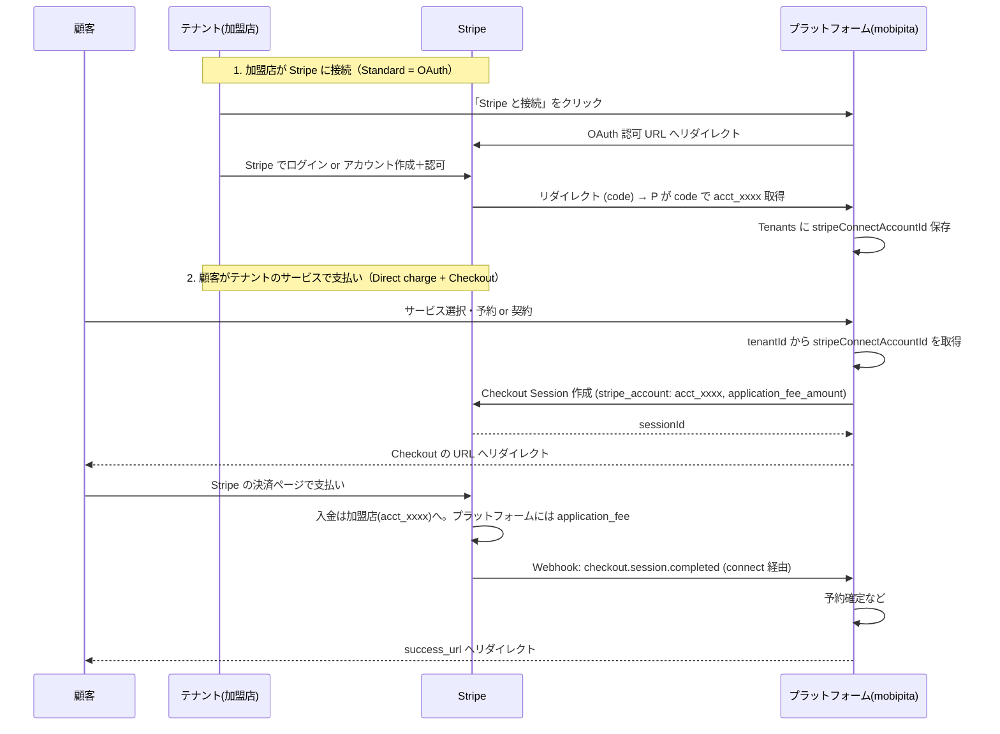

# Stripe Connect（プラットフォーム）実装方針

- **前提**: 今の「テナントに対してサービスをつける」実装はそのまま。テナント＝加盟店（Connected Account）として Stripe Connect を載せる。
- **採用する方式**:
  - **加盟店（連結アカウント）**: **Standard** … 加盟店が Stripe と直接契約する「普通の Stripe アカウント」。Dashboard にログインして売上・入金を自分で確認できる。
  - **支払い方式**: **Direct charges** … 決済はプラットフォームではなく**連結アカウント側**に作成される。入金は最初から加盟店に入り、プラットフォームは `application_fee` で手数料を取る。
  - **決済 UI**: **Stripe Checkout（リダイレクト）** … Stripe の決済ページへ飛ばすだけではやく実装できる。

---

## 1. 用語と役割

| 役割 | 説明 | 自アプリでの対応 |
|------|------|------------------|
| **プラットフォーム** | Connect を提供し、OAuth で加盟店と接続。決済は加盟店アカウントで発生させ、手数料を得る。 | mobipita（自社）の Stripe アカウント |
| **加盟店（連結アカウント）** | 自分で Stripe アカウントを持ち、OAuth でプラットフォームに「接続」する。売上・入金は自分の Dashboard で確認。 | **テナント**（`Tenants` 1件 = 接続済みなら 1 つの `acct_xxxx`） |
| **顧客** | サービスを予約・購入し、代金を支払う人。 | 会員（Clerk User） |

- サービスは **今どおりテナントに紐づく**（`Services.tenantId`）。変更なし。
- 課金時は「どのテナントのサービスか」でそのテナントの連結アカウント ID（`stripeConnectAccountId`）を指定し、**そのアカウント向けに** Checkout Session を作成する（Direct charge）。

---

## 2. Standard 連結アカウントの特徴

- 加盟店（テナント）が **自分で Stripe アカウント** を持つ。
  - 既に Stripe アカウントを持っていれば、そのアカウントを「プラットフォームに接続」する。
  - 持っていなければ、OAuth の導線で Stripe のアカウント作成〜接続まで行える。
- **Stripe Dashboard** に加盟店自身がログインし、売上・入金・顧客を確認できる。
- プラットフォームは「接続」時に返ってくる **アカウント ID（`acct_xxxx`）** をテナントに紐づけて保存するだけ。決済はすべてそのアカウント向けに作成する（Direct charge）。

---

## 3. データの持ち方（現行のまま＋Connect 用の追加）

- **変更しない**: テナント・サービス・予約枠・予約の関係（テナントごとにサービスを作り、そのサービスに枠・予約が紐づく）。
- **追加する**:
  - テナントに **連結アカウント ID** を 1 つ持たせる（Standard は OAuth で取得）。

### 3.1 テナントに持たせるもの

| 項目 | 説明 | 保存場所 |
|------|------|----------|
| `stripeConnectAccountId` | 連結アカウント ID（`acct_xxxx`）。OAuth 完了時に Stripe から返る。 | `Tenants` にカラム追加（optional） |

- 既存の `Tenants` に `stripeConnectAccountId`（optional）を足す。
- サービスは従来どおり `tenantId` のみで紐付け。課金時に `tenantId` → `stripeConnectAccountId` を引く。未連携なら「この店舗はまだ Stripe と接続されていません」と表示し、決済ボタンを出さない。

---

## 4. 全体フロー（Standard OAuth → Direct charge + Checkout）



- **今の「テナントにサービスをつける」実装はそのまま**。上記は「そのテナントの連結アカウントに対して、Direct charge で Checkout を出す」流れ。

---

## 5. Direct charges（連結アカウントに直接支払い）

- **流れ**: 決済は **加盟店の Stripe アカウント** に対して作成する。入金は最初から加盟店に入り、プラットフォームは `application_fee_amount` で手数料を受け取る。
- **利点**:
  - 加盟店が自分の Stripe Dashboard で売上・入金をそのまま確認できる（Standard のメリットを活かせる）。
  - プラットフォームは「どのテナントの売上か」を `metadata` などで把握しつつ、手数料だけを受け取る。
- **実装の要**: すべての Stripe API 呼び出しで **`stripe_account: tenant.stripeConnectAccountId`** を渡し、そのアカウント向けに Checkout Session / PaymentIntent などを作成する。

---

## 6. Stripe Checkout（リダイレクト型）

- 顧客を **Stripe のホスト型決済ページ** に飛ばし、支払い完了後に `success_url` へ戻す。
- **利点**: カード入力欄・3D Secure・請求先情報などを自前で実装しなくてよい。実装が速い。
- **流れ**:
  1. プラットフォームが **Checkout Session** を作成（作成時は `stripeAccount: tenant.stripeConnectAccountId` で Direct charge）。
  2. 返ってきた `url` に顧客をリダイレクト。
  3. 顧客が Stripe のページで支払い → 完了後、`success_url` にリダイレクト。
  4. バックエンドでは Webhook `checkout.session.completed` で予約確定・在庫更新などを行う（Connect の場合は、連結アカウントで発生したイベントがプラットフォームの Webhook に届く）。

### 6.1 Checkout Session 作成のイメージ（Direct charge）

```ts
// 疑似コード（Stripe Node SDK。API は最新ドキュメントで要確認）
const session = await stripe.checkout.sessions.create(
  {
    mode: 'payment', // 単発。月額なら 'subscription'
    line_items: [
      {
        price_data: {
          currency: 'jpy',
          product_data: { name: 'スクールレッスン 1回', description: '...' },
          unit_amount: 5000,
        },
        quantity: 1,
      },
    ],
    success_url: `${baseUrl}/reserve/success?session_id={CHECKOUT_SESSION_ID}`,
    cancel_url: `${baseUrl}/reserve?canceled=1`,
    client_reference_id: bookingId, // 予約IDなど
    metadata: { tenantId, slotId, bookingId },
    application_fee_amount: 500, // プラットフォーム手数料（円）
  },
  { stripeAccount: tenant.stripeConnectAccountId } // Direct charge
);

// 顧客を session.url にリダイレクト
redirect(session.url);
```

- 月額の場合は `mode: 'subscription'` とし、`line_items` に `price`（Price ID）を指定する形になる。Subscription も同じく `stripeAccount` で連結アカウント向けに作成する。

---

## 7. 実装ステップ（Standard + Direct charge + Checkout）

1. **Stripe アカウント**
   - 自社の Stripe アカウントで [Connect を有効化](https://dashboard.stripe.com/settings/connect)する。
   - [Connect の設定](https://dashboard.stripe.com/settings/connect)で **Standard アカウント** を有効にし、OAuth のリダイレクト URI（例: `https://your-app.com/api/stripe/connect/callback`）を登録する。

2. **テナントに連結アカウント ID を追加**
   - `Tenants` に `stripeConnectAccountId`（optional）を追加。
   - 既存のサービス・枠・予約はそのまま（すべて `tenantId` で紐づいている前提）。

3. **加盟店の接続（Standard = OAuth）**
   - スタッフ画面に「Stripe と接続」ボタンを用意。
   - クリックで Stripe の OAuth 認可 URL へリダイレクト（`client_id`, `redirect_uri`, `response_type=code`, `scope` など。Stripe の [Connect OAuth ドキュメント](https://stripe.com/docs/connect/oauth-reference) を参照）。
   - 認可後、Stripe が `redirect_uri?code=xxx` で戻す。バックエンドで `code` を `stripe.oauth.token` に渡し、返ってきた `stripe_user_id`（= `acct_xxxx`）を `Tenants.stripeConnectAccountId` に保存。
   - 未連携のテナントでは決済ボタンを出さず、「店舗が Stripe と接続するとご利用できます」などと表示。

4. **課金フロー（Checkout リダイレクト）**
   - 顧客がテナントのサービスで予約 or 契約する → 既存ロジックで `tenantId` が決まる。
   - `tenantId` から `stripeConnectAccountId` を取得。無い場合は上記のメッセージ表示。
   - `stripe.checkout.sessions.create(..., { stripeAccount: stripeConnectAccountId })` で Checkout Session を作成し、`session.url` に顧客をリダイレクト。
   - 顧客は Stripe のページで支払い → 完了後 `success_url` に戻る。フロントでは「ご予約ありがとうございます」など表示。
   - 予約確定は **Webhook** で行う（次の項）。

5. **Webhook（Connect イベント）**
   - プラットフォームの Webhook エンドポイントを 1 つ用意する。
   - Direct charge では決済は**連結アカウント**で発生するため、Stripe の [Connect 用 Webhook](https://stripe.com/docs/connect/webhooks) を有効にする。連結アカウントで起きた `checkout.session.completed` などがプラットフォームに届く。
   - 受信したイベントの `account` が `acct_xxxx` なので、そこから `tenantId` を逆引きし、`metadata` の `bookingId` などで予約を「支払い済み」に更新する。
   - 返金・争议対応が必要なら `charge.refunded` なども購読する。

6. **月額・サブスク**
   - Stripe の [Subscription](https://stripe.com/docs/billing/subscriptions/overview) を使う。Checkout の `mode: 'subscription'` で Session を作成する場合も、同じく `stripeAccount: tenant.stripeConnectAccountId` で連結アカウント向けに作成する。
   - 詳細は [Connect + Billing](https://stripe.com/docs/connect/billing) を参照。

---

## 8. まとめ

| 項目 | 方針 |
|------|------|
| サービス・枠・予約 | **現行のまま**。テナントに紐づける実装を変えない。 |
| 連結アカウント | **Standard**。加盟店が自分の Stripe アカウントを持ち、OAuth でプラットフォームに接続。Dashboard で売上・入金を自分で確認できる。 |
| 支払い方式 | **Direct charges**。決済は連結アカウント側に作成。プラットフォームは `application_fee_amount` で手数料を受け取る。 |
| 決済 UI | **Stripe Checkout（リダイレクト）**。Session 作成時に `stripeAccount` を渡し、返ってきた `url` に顧客を飛ばす。 |
| テナントの保存項目 | `Tenants.stripeConnectAccountId`（OAuth 完了時に取得）。 |
| Webhook | Connect 用 Webhook で連結アカウントの `checkout.session.completed` 等を受け取り、予約確定・返金処理を行う。 |

この構成で、「テナントに対してサービスをつける」実装を変えずに、Standard 加盟店向けの Direct charge と Stripe Checkout リダイレクトで決済を実装できる。
